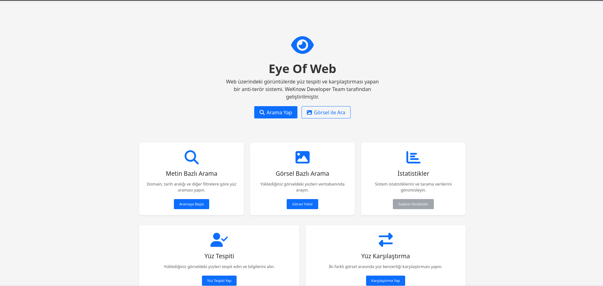
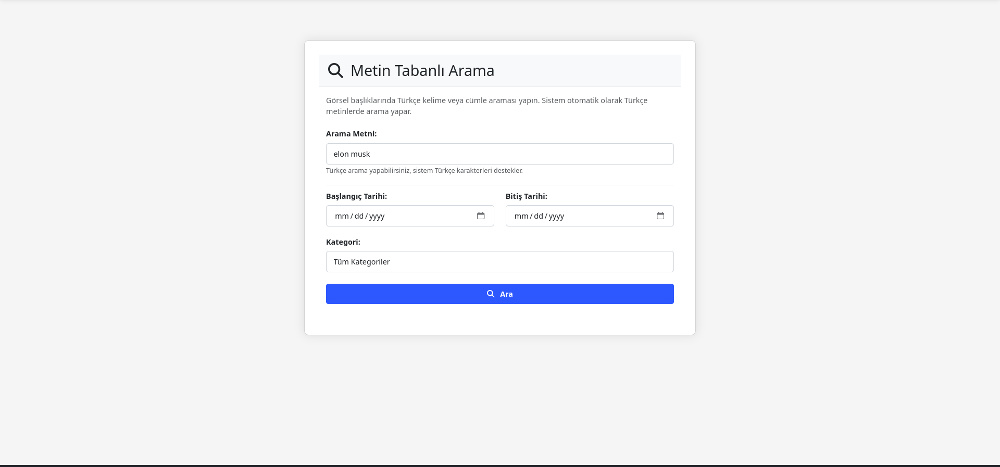
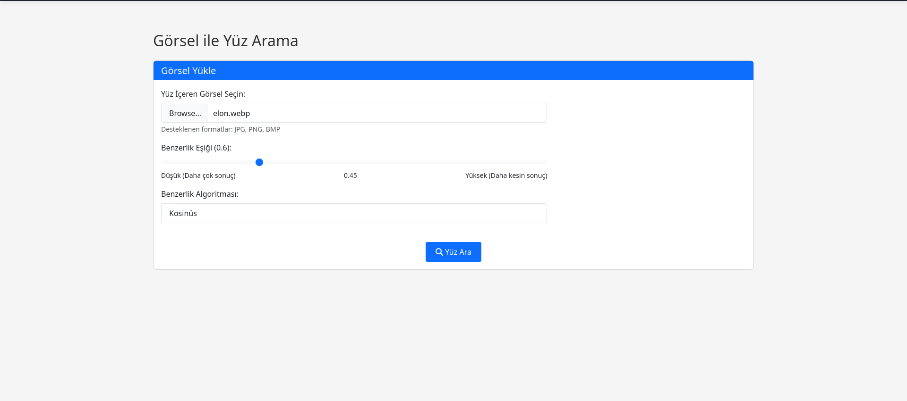
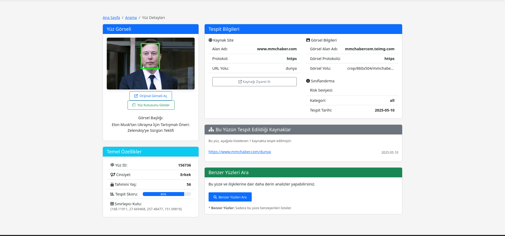

<div align="center">
  

  # 👁️ EyeOfWeb

  ### Продвинутая Веб-Платформа для Анализа Лиц и Безопасности
  ### Advanced Web-Based Facial Intelligence & Security Analysis Platform

  [](https://opensource.org/licenses/MIT)
  
  
  
  
  
  

  ---

  **[🇹🇷 Türkçe Dokümantasyon](README.md#-türkçe-dokümantasyon)** | **[🇬🇧 English Documentation](README.md#-english-documentation)** | **[🇷🇺 Russian Documentation](#-russian-documentation)** | **[🇨🇳 Chinese Documentation](README_CN.md)**

</div>

---

> [!IMPORTANT]
> ## 📜 ЮРИДИЧЕСКИЙ ОТКАЗ ОТ ОТВЕТСТВЕННОСТИ / LEGAL DISCLAIMER
>
> ### 🇷🇺 Русский
> **EyeOfWeb** был разработан исключительно для академических исследований, образования и моделирования сценариев безопасности. Использование этого программного обеспечения на реальных людях без их согласия, несанкционированный сбор или хранение персональных данных может нарушать **KVKK** (Закон Турции о защите персональных данных), **GDPR** (Общий регламент по защите данных ЕС) и другие национальные/международные законы о конфиденциальности и может привести к серьезным юридическим санкциям.
>
> Разработчики проекта не несут никакой прямой или косвенной юридической, финансовой или уголовной ответственности за любое незаконное или неэтичное использование программного обеспечения. **Вся юридическая и этическая ответственность лежит на конечном пользователе, использующем программное обеспечение.**
>
> ### 🇬🇧 English
> **EyeOfWeb** has been developed strictly for academic research, education, and legal security simulations. Unauthorized use, collection, or storage of personal data on real individuals may violate **KVKK** (Turkish Data Protection Law), **GDPR**, and other international privacy laws, resulting in serious legal penalties.
>
> The developers assume no direct or indirect legal, financial, or criminal liability for any illegal or unethical use of the software. **The end-user bears full legal and ethical responsibility.**

---

## 🇷🇺 Russian Documentation

---

### 📋 Содержание (Table of Contents)

1.  [🐳 Быстрый старт с Docker](#-быстрый-старт-с-docker--quick-start-with-docker)
2.  [Краткий обзор](#-краткий-обзор--executive-summary)
3.  [Основные функции и возможности](#-основные-функции-и-возможности)
4.  [Техническая архитектура](#-техническая-архитектура)
5.  [Технологический стек](#-технологический-стек-tech-stack)
6.  [Структура проекта](#-структура-проекта)
7.  [Руководство по установке](#️-руководство-по-установке)
8.  [Варианты конфигурации](#️-варианты-конфигурации)
9.  [Лицензия](#-лицензия)
10. [Благодарности и участники](#-благодарности-и-участники)
11. [Скриншоты интерфейса](#-скриншоты-интерфейса)

---

### 📚 Подробная документация / Detailed Documentation

| Файл / File | Описание / Description |
|--------------|------------------------|
| [doc/DOCKER.md](doc/DOCKER.md) | 🐳 Руководство по установке и управлению Docker |
| [doc/CRAWLER.md](doc/CRAWLER.md) | 🕷️ Руководство пользователя Crawler (Турецкий) |
| [doc/CRAWLER_EN.md](doc/CRAWLER_EN.md) | 🕷️ Crawler user guide (English) |
| [doc/CHANGELOG.md](doc/CHANGELOG.md) | 📝 Журнал изменений / Changelog |

---

### 🐳 Быстрый старт с Docker / Quick Start with Docker

> [!TIP]
> **Самый быстрый способ начать работу - использовать Docker!**
> **Docker is the fastest way to get started!**
>
> **Примечание / Note:** Образ Docker по умолчанию использует версию **Torch CPU** для экономии места. Вам может потребоваться изменить установку Torch в `src/Dockerfile` для использования GPU.
> **Note:** The Docker image uses the **Torch CPU** version by default to save space. You may need to modify the Torch installation in `src/Dockerfile` for GPU usage.

```bash
# 1. Клонировать репозиторий
git clone https://github.com/MehmetYukselSekeroglu/eye_of_web.git
cd eye_of_web/src

# 2. Запустить с помощью Docker Compose
sudo docker compose up -d --build

# 3. Следить за логами
sudo docker compose logs -f web
```

**Доступ:** http://localhost:5000
**Администратор по умолчанию:** `admin` / `admin123_changeme`

#### Сервисы / Services

| Сервис / Service | Порт | Описание / Description |
|------------------|------|------------------------|
| Веб-приложение | 5000 | Основной веб-интерфейс / Main web interface |
| PostgreSQL | 5432 | Реляционная база данных / Relational database |
| Milvus | 19530 | Векторная база данных / Vector database |
| Crawler Worker | - | Фоновый сканер / Background crawler |

> 📖 **Для детальной установки:** [doc/DOCKER.md](doc/DOCKER.md)

---

### 🎥 Примеры использования и видео анализа (Example Usage & Analysis Videos)

#### 1. Общий пример использования (General Usage Example)
[](https://www.youtube.com/watch?v=s_Ak0tiq1f4)

#### 2. Комплексный анализ персоны (Comprehensive Person Analysis)
[](https://www.youtube.com/watch?v=gdoNdIjJr5E)


---

### 📄 Краткий обзор / Executive Summary

**EyeOfWeb** — это комплексная и профессиональная платформа разведки безопасности, которая объединяет методологии разведки по открытым источникам (OSINT) с технологиями биометрического анализа нового поколения на основе глубокого обучения.

Система автономно сканирует визуальные данные из различных источников в Интернете (новостные порталы, блоги, RSS-каналы и т.д.), обнаруживает лица на этих изображениях, создает уникальный математический вектор (эмбеддинг) для каждого лица и индексирует эти векторы в высокопроизводительной векторной базе данных (Milvus). Параллельно метаданные, такие как источник, дата и уровень риска обнаруженных лиц, сохраняются в реляционной базе данных (PostgreSQL).

Благодаря этой «гибридной архитектуре баз данных» EyeOfWeb может выполнять расширенный анализ, такой как поиск личности 1:N, сравнение лиц 1:1, анализ социальных сетей/связей и профилирование персон среди миллиардов данных о лицах за **миллисекунды**.

---

### 🚀 Основные функции и возможности

Ниже подробно описаны все основные функции, определенные в модуле `src/app/routes/web.py` и доступные через пользовательский интерфейс/API.

---

#### 1. Комплексный анализ персоны (Comprehensive Person Analysis)

Это самый мощный и сложный инструмент анализа EyeOfWeb. Он выполняет комплексный социометрический анализ на основе фотографий конкретного человека.

**Маршрут:** `/comprehensive_person_analysis/<face_id>`

**Как это работает:**
1.  **Сбор цели и контекста:** Собирается целевое лицо (`face_id`) и ВСЕ другие лица, появляющиеся в тех же кадрах.
2.  **Стратегия "Cluster All" (Кластеризовать всех):** Все собранные лица (включая цель) кластеризуются вместе с использованием продвинутого алгоритма жадной кластеризации. Это идеально отделяет целевого человека от двойников или ошибочных обнаружений.
3.  **Идентификация кластера цели:** Кластер, принадлежащий «Целевой Персоне», идентифицируется с использованием исходных данных лица и сходства эмбеддингов.
4.  **Анализ отношений:** Подсчитываются только случаи, когда лицо из «Кластера Цели» появляется на одном изображении с лицом из «Другого Кластера».
5.  **Результаты:** Этот метод устраняет проблемы **ложных срабатываний (false positives)** и **самосовпадения (self-matching)**, обеспечивая наиболее точный социометрический анализ.

**Сценарии использования:**
*   Картирование социального круга человека.
*   Анализ того, в каких средах и с кем находится человек.
*   Выявление паттернов связей (network patterns).

**Выводы:**
*   Список связанных лиц (с репрезентативным изображением лица).
*   Количество совместных появлений и размер группы для каждого связанного лица.
*   Статистика анализа (всего обработано лиц, уникальных изображений и т.д.).
*   Загружаемый PDF отчет (`/download/comprehensive_analysis_report`).

---

#### 2. Глубокий анализ отношений (Deep Insight)

Анализирует, как часто конкретное лицо появляется на одной фотографии с другими лицами, зарегистрированными в системе. Обеспечивает более быструю альтернативу Комплексному анализу персоны, но не выполняет группировку на основе сходства.

**Маршрут:** `/deep_insight/<face_id>`

**Как это работает:**
1.  Все изображения, содержащие целевое лицо (`face_id`), извлекаются из PostgreSQL (таблица `ImageBasedMain`).
2.  Перечисляются все другие лица, найденные вместе с целевым лицом на этих изображениях.
3.  Подсчитывается, на скольких различных изображениях каждое другое лицо появляется вместе с целевым лицом.
4.  Топ-10 наиболее часто встречающихся лиц перечисляются с подробной информацией.

---

#### 3. Несколько режимов поиска

EyeOfWeb предлагает различные режимы поиска для удовлетворения различных потребностей.

##### a) Поиск по изображению (Image Search)
**Маршрут:** `/search/image`, `/search/upload`

Сравнивает лицо на фотографии, загруженной пользователем, со всеми записями в базе данных.
*   Загруженное изображение проходит проверку безопасности.
*   Генерируется 512-размерный вектор с использованием модели InsightFace.
*   Поиск по этому вектору в базе данных Milvus с использованием `Cosine Similarity`.

##### b) Текстовый поиск/Фильтрация (Text/Filter Search)
**Маршрут:** `/search`, `/search/text`

Поиск по структурным данным (метаданным) через PostgreSQL.
*   `domain`: Фильтрует результаты с определенного веб-сайта.
*   `start_date` / `end_date`: Фильтр по диапазону дат обнаружения.
*   `risk_level`: Фильтрация по уровню риска.
*   `category`: Фильтрация по категории веб-сайта.

##### c) Поиск похожих лиц (Similar Face Search)
**Маршрут:** `/search/similar/<face_id>`

Ищет другие лица, похожие на лицо, уже зарегистрированное в базе данных (`face_id`).

---

#### 4. Обнаружение и сравнение лиц

##### a) Обнаружение лиц (Face Detection)
**Маршрут:** `/face/detection`

Обнаруживает все лица на любом загруженном изображении, показывая bounding box, пол, возраст и оценку уверенности.

##### b) Сравнение лиц (Face Comparison)
**Маршрут:** `/face/comparison`

Анализирует, совпадают ли первые лица на двух разных загруженных изображениях (сравнение 1:1).

---

#### 5. Несколько коллекций баз данных

EyeOfWeb поддерживает несколько коллекций Milvus и таблиц PostgreSQL:

| Имя коллекции / таблицы          | Описание                                                                 |
| :------------------------------- | :----------------------------------------------------------------------- |
| `EyeOfWebFaceDataMilvus`         | Основная коллекция векторов лиц, собранная системой.        |
| `WhiteListFacesMilvus`           | Коллекция вручную добавленных "распознанных" или "разрешенных" лиц.|
| `ExternalFaceStorageMilvus`      | Лица, переданные из внешних источников (API и т.д.).                             |
| `CustomFaceStorageMilvus`        | Пользовательская коллекция.                                       |

---

#### 6. Панель управления (Admin Dashboard)

**Маршрут:** `/dashboard` (Только для администраторов)

Центральный экран управления, показывающий статистику и состояние системы.

---

#### 7. Система отчетности PDF

EyeOfWeb может создавать профессиональные отчеты в формате PDF для всех выполненных анализов (поиск изображений, комплексный анализ и т.д.).

---

### 🏛️ Техническая архитектура

---

#### Гибридная система баз данных (PostgreSQL + Milvus)

EyeOfWeb использует гибридную архитектуру, которая обрабатывает структурные/реляционные данные и многомерные векторные данные отдельно.

| Компонент     | База данных  | Хранимые данные | Назначение |
| :------------ | :----------- | :-------------- | :--------- |
| **Память**    | PostgreSQL   | Пользователи, компоненты URL, заголовки, хеши, даты, уровни риска | SQL-запросы, фильтрация, объединение (`JOIN`), метаданные |
| **Мозг**      | Milvus       | 512-d векторов лиц, 212-d векторов ландмарок | ANN поиск (HNSW), расчет сходства (`Cosine Similarity`) |

---

#### Движок ИИ: InsightFace & AntelopeV2

EyeOfWeb использует стандартную для индустрии библиотеку **InsightFace** и модель **AntelopeV2**.

**Характеристики модели:**
*   **Обнаружение лиц:** RetinaFace
*   **Размер вектора:** 512 измерений
*   **Атрибуты:** Пол, Возраст, Очки, Оценка качества

---

#### Инфраструктура безопасности

*   **Аутентификация:** Flask-JWT-Extended
*   **Управление сессиями:** Flask-Session (Server-Side)
*   **Шифрование:** Flask-Bcrypt
*   **Защита CSRF:** Flask-WTF
*   **Ограничение скорости (Rate Limiting):** Flask-Limiter

---

### 🛠️ Технологический стек (Tech Stack)

| Уровень              | Технология                                 | Версия / Примечания           |
| :------------------- | :----------------------------------------- | :---------------------------- |
| **Язык**             | Python                                     | 3.8+                          |
| **Web Framework**    | Flask                                      | 2.0+                          |
| **WSGI Server**      | Gunicorn / Waitress                        | Для Production                |
| **Реляционная БД**   | PostgreSQL                                 | 13+                           |
| **Векторная БД**     | Milvus                                     | 2.3+                          |
| **ML / AI**          | InsightFace (ONNX Runtime), NumPy, SciPy   | Модель AntelopeV2             |
| **Обработка изображений** | OpenCV (cv2), Pillow (PIL)            |                               |
| **Безопасность**     | Flask-JWT-Extended, Flask-Bcrypt           |                               |
| **Web Crawling**     | Selenium, Playwright                       | Async/Multi-tab Support       |
| **Frontend**         | HTML5, CSS3, JavaScript, Jinja2            | Responsive UI                 |
| **Контейнеризация**  | Docker, Docker Compose                     |                               |

---

### 📁 Структура проекта

```
eye_of_web/
├── .git/                           # Git version control
├── .gitignore                      # Files ignored by Git
├── LICENSE                         # MIT License
├── README.md                       # This documentation file
├── img/                            # Static images (logo, etc.)
│   └── logo.png
│
└── src/                            # Main source code directory
    ├── run.py                      # Flask application startup script
    ├── requirements.txt            # Python dependencies
    │
    ├── app/                        # Flask Application Module (MVC Architecture)
    │   ├── __init__.py             # Flask application factory
    │   ├── config/                 # Application configuration files
    │   ├── controllers/            # Business logic layer
    │   ├── models/                 # Database models / ORM
    │   ├── routes/                 # URL routing and endpoint definitions
    │   ├── static/                 # Static files (CSS, JS, images)
    │   └── templates/              # Jinja2 HTML templates
    │
    ├── config/                     # System configuration files
    │   ├── config.json             # GPU mode configuration
    │   └── cpu_config.json         # CPU mode configuration
    │
    ├── lib/                        # Helper libraries and tools
    │   ├── database_tools.py       # PostgreSQL & Milvus operations
    │   ├── init_insightface.py     # InsightFace model initialization
    │   └── pdf_generator.py        # PDF report generation
    │
    └── sql/                        # SQL schema and query files
```

---

### ⚙️ Руководство по установке

#### Системные требования

| Компонент     | Минимум                        | Рекомендуется                        |
| :------------ | :----------------------------- | :----------------------------------- |
| **OS**        | Ubuntu 18.04+ / Windows 10 WSL2 | Ubuntu 20.04+ / Debian 11+          |
| **CPU**       | 4 Cores (x86_64)               | 8+ Cores (AVX2 supported)            |
| **RAM**       | 8 GB                           | 16 GB или больше                     |
| **GPU**       | Опционально                    | NVIDIA GPU (CUDA 11.x+), 4GB+ VRAM   |

#### Пошаговая установка

**1. Системные зависимости (Ubuntu/Debian):**
```bash
sudo apt-get update && sudo apt-get upgrade -y
sudo apt-get install -y python3-dev python3-pip python3-venv git \
    postgresql postgresql-contrib libpq-dev \
    build-essential libssl-dev libffi-dev \
    docker.io docker-compose
sudo systemctl enable docker && sudo systemctl start docker
```

**2. Клонирование исходного кода:**
```bash
git clone https://github.com/MehmetYukselSekeroglu/eye_of_web.git
cd eye_of_web
```

**3. Создание виртуального окружения Python:**
```bash
python3 -m venv venv
source venv/bin/activate  # Windows: venv\Scripts\activate
pip install --upgrade pip
pip install -r src/requirements.txt
```

**4. Запуск базы данных Milvus (Docker):**
```bash
wget https://github.com/milvus-io/milvus/releases/download/v2.3.0/milvus-standalone-docker-compose.yml -O docker-compose.yml
sudo docker-compose up -d
```

**5. Настройка PostgreSQL:**
```bash
sudo systemctl start postgresql
sudo -u postgres psql << EOF
CREATE DATABASE eyeofweb;
CREATE USER eyeofwebuser WITH ENCRYPTED PASSWORD 'strong_password_here';
GRANT ALL PRIVILEGES ON DATABASE eyeofweb TO eyeofwebuser;
\q
EOF
```

**6. Генерация схем БД:**
```bash
python src/MILVUS_SCHEMA_GENERATOR.py
```

**7. Запуск приложения:**
```bash
python src/run.py
```
Перейдите по адресу `http://localhost:5000` в браузере.

---

### ⚙️ Варианты конфигурации

#### Конфигурация InsightFace (GPU/CPU)

**`src/config/config.json` (GPU Mode):**
```json
{
  "insightface": {
    "prepare": {
      "ctx_id": 0,
      "det_thresh": 0.6,
      "det_size": [640, 640]
    },
    "main": {
      "providers": ["CUDAExecutionProvider"],
      "name": "antelopev2"
    }
  }
}
```

**`src/config/cpu_config.json` (CPU Mode):**
```json
{
  "insightface": {
    "prepare": {
      "ctx_id": -1,
      "det_thresh": 0.5,
      "det_size": [160, 160]
    },
    "main": {
      "providers": ["CPUExecutionProvider"],
      "name": "antelopev2"
    }
  }
}
```

---

### 📄 Лицензия

Этот проект лицензируется в соответствии с **MIT License**.

Пожалуйста, смотрите файл `LICENSE` в корневом каталоге проекта для полного текста лицензии.

---

### 🙏 Благодарности и участники

Мы хотели бы выразить благодарность всем, кто внес вклад в реализацию этого проекта.

---

#### Консультант / Преподаватель (Advisor / Instructor)

| | |
|---|---|
| **Имя** | **Uğur POLAT** |
| **Вклад** | Академическое руководство, управление проектом, архитектурное видение и техническое консультирование |

---

#### Исследователь безопасности / Security Research

| | |
|---|---|
| **Имя** | **Enes Ülker** |
| **Вклад** | Исследователь кибербезопасности / Cyber Security Researcher |

---

#### Владелец проекта / Ведущий разработчик (Project Owner / Lead Developer)

| | |
|---|---|
| **Имя** | **Mehmet Yüksel ŞEKEROĞLU** |
| **Вклад** | Full-stack разработка, интеграция модели ИИ, проектирование БД, системная архитектура и документация |

---

### 📸 Скриншоты интерфейса

| Экран | Изображение |
|-------|---------|
| **Экран приветствия** |  |
| **Ввод текстового поиска** |  |
| **Результаты текстового поиска** |  |
| **Поиск лица - Добавление фото** |  |
| **Поиск лица - Результаты** |  |
| **Поиск лица - Расширенные результаты** |  |
| **Обнаружение лиц** |  |
| **Сравнение лиц** |  |
