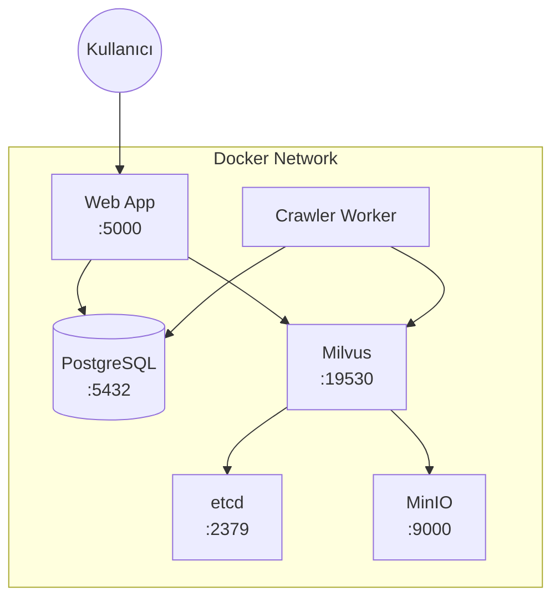

# EyeOfWeb Docker Kurulum Kılavuzu

Bu döküman, EyeOfWeb sisteminin Docker ile nasıl kurulup çalıştırılacağını detaylı olarak açıklamaktadır.

## 📋 İçindekiler

- [Gereksinimler](#gereksinimler)
- [Hızlı Başlangıç](#hızlı-başlangıç)
- [Servis Mimarisi](#servis-mimarisi)
- [Yapılandırma](#yapılandırma)
- [Detaylı Kurulum](#detaylı-kurulum)
- [Crawler Kullanımı](#crawler-kullanımı)
- [Yönetim Komutları](#yönetim-komutları)
- [Sorun Giderme](#sorun-giderme)
- [Güvenlik](#güvenlik)

---

## Gereksinimler

### Sistem Gereksinimleri

| Bileşen | Minimum | Önerilen |
|---------|---------|----------|
| RAM | 8 GB | 16 GB+ |
| CPU | 4 Core | 8 Core+ |
| Disk | 50 GB | 100 GB+ SSD |
| GPU | - | NVIDIA (CUDA destekli) |

### Yazılım Gereksinimleri

- **Docker**: 20.10+
- **Docker Compose**: 2.0+
- **Git**: (kaynak kodu klonlamak için)

```bash
# Docker sürümünü kontrol edin
docker --version
docker compose version
```

> [!TIP]
> **docker compose vs docker-compose:** Bu dokümanda `docker compose` (tiresiz) kullanılmaktadır. Bu, Docker Compose v2+ için doğru yazımdır. Eğer eski bir sistem kullanıyorsanız ve `docker compose` komutu çalışmıyorsa, `docker-compose` (tireli) kullanabilirsiniz. Örnek: `docker-compose up -d --build`

---

## Hızlı Başlangıç

Sistemi en hızlı şekilde ayağa kaldırmak için:

```bash
# 1. Proje dizinine gidin
cd /path/to/eye_of_web/src

# 2. Tüm servisleri başlatın
docker compose up -d --build

# 3. Logları izleyin
docker compose logs -f web
```

> [!NOTE]
> İlk çalıştırmada Docker imajları indirilecek ve derlenecektir. Bu işlem internet hızınıza bağlı olarak 5-15 dakika sürebilir.

---

## Servis Mimarisi



### Servisler

| Servis | Port | Açıklama |
|--------|------|----------|
| `web` | 5000 | Ana Flask web uygulaması |
| `crawler_worker` | - | Crawler işlemleri için worker container |
| `db` | 5432 | PostgreSQL veritabanı (pgvector ile) |
| `milvus` | 19530, 9091 | Milvus vektör veritabanı |
| `etcd` | 2379 | Milvus için metadata store |
| `minio` | 9000 | Milvus için object storage |

---

## Yapılandırma

### Ortam Değişkenleri

`docker-compose.yml` dosyasında aşağıdaki ortam değişkenlerini düzenleyebilirsiniz:

#### Web Servisi

```yaml
environment:
  # Flask Ayarları
  - FLASK_ENV=production          # production veya development
  - SECRET_KEY=changeme_in_production  # Güvenli bir key kullanın!
  
  # Veritabanı Bağlantısı
  - DB_HOST=db
  - DB_PORT=5432
  - DB_USER=postgres
  - DB_PASSWORD=postgres          # Güvenli bir parola kullanın!
  - DB_NAME=EyeOfWeb
  
  # Milvus Bağlantısı
  - MILVUS_HOST=milvus
  - MILVUS_PORT=19530
  
  # Uygulama Ayarları
  - INIT_SCHEMA=true              # İlk çalıştırmada true, sonra false yapın
  - GUNICORN_WORKERS=4            # CPU çekirdek sayısına göre ayarlayın
  - GUNICORN_THREADS=2
```

> [!IMPORTANT]
> **Prodüksiyon ortamında** `SECRET_KEY` ve `DB_PASSWORD` değerlerini mutlaka değiştirin!

### Özel Yapılandırma Dosyası

Uygulama için özel bir `config.json` dosyası oluşturabilirsiniz:

```bash
# config dizini oluşturun
mkdir -p config

# config.json dosyasını oluşturun
cat > config/config.json << 'EOF'
{
  "database_config": {
    "host": "db",
    "port": "5432",
    "user": "postgres",
    "password": "postgres",
    "database": "EyeOfWeb"
  },
  "initial_admin_user": {
    "username": "admin",
    "password": "your_secure_password"
  }
}
EOF
```

---

## Detaylı Kurulum

### Adım 1: Projeyi Hazırlayın

```bash
# Proje dizinine gidin
cd /path/to/eye_of_web/src

# Gerekli dizinleri oluşturun
mkdir -p logs uploads temp certs config
```

### Adım 2: Docker İmajlarını Oluşturun

```bash
# Tüm imajları derleyin
docker compose build

# Veya sadece web imajını derleyin
docker compose build web
```

### Adım 3: Veritabanını Başlatın

```bash
# Önce veritabanı servislerini başlatın
docker compose up -d db etcd minio milvus

# Veritabanının hazır olmasını bekleyin (yaklaşık 30 saniye)
sleep 30

# Veritabanı loglarını kontrol edin
docker compose logs db
```

### Adım 4: Şemaları Oluşturun

PostgreSQL şemaları otomatik olarak `sql/` dizinindeki dosyalardan yüklenir. Milvus şemaları ise uygulama başlatılırken `INIT_SCHEMA=true` ile oluşturulur.

```bash
# Şemaların oluşturulduğunu kontrol edin
docker compose exec db psql -U postgres -d EyeOfWeb -c "\\dt"
```

### Adım 5: Web Uygulamasını Başlatın

```bash
# Web servisini başlatın
docker compose up -d web

# Uygulamanın başladığını kontrol edin
docker compose logs -f web
```

### Adım 6: Erişimi Test Edin

```bash
# Health check
curl http://localhost:5000/health

# Veya tarayıcıda açın
# http://localhost:5000
```

---

## Crawler Kullanımı

### Docker vs Ana OS Crawler Farkları

> [!IMPORTANT]
> **Selenium gerektiren crawler'lar Docker container'da çalışmaz!**
> Bu crawler'ları ana işletim sisteminde çalıştırmalısınız.

| Crawler Türü | Docker | Ana OS | Açıklama |
|--------------|--------|--------|----------|
| `single_domain.py` | ✅ | ✅ | HTTP tabanlı, tarayıcı gerektirmez |
| `rss_crawler.py` | ✅ | ✅ | RSS/Atom feed parser |
| `google_search_crawler.py` | ✅ | ✅ | DuckDuckGo API tabanlı |
| `pyrogram_telegram_crawler_main.py` | ✅ | ✅ | Telegram API tabanlı |
| `telethon_telegram_crawler_main.py` | ✅ | ✅ | Telegram API tabanlı |
| `twitter_crawler_*.py` | ❌ | ✅ | Selenium + Chrome gerektirir |
| `google_images_crawler.py` | ❌ | ✅ | Selenium + Chrome gerektirir |
| `facebook_crawler.py` | ❌ | ✅ | Selenium + Chrome gerektirir |
| `flicker_crawler.py` | ❌ | ✅ | Selenium + Chrome gerektirir |

### Requirements Dosyaları

| Dosya | Kullanım Alanı |
|-------|----------------|
| `requirements.txt` | Ana web uygulaması (Docker) |
| `docker_crawler_requirements.txt` | Docker container'daki crawler'lar |
| `crawler_requirements.txt` | Ana OS'daki crawler'lar (Selenium dahil) |

### Docker Container'da Crawler Çalıştırma

```bash
# Container'a bağlan
sudo docker exec -it eyeofweb_crawler bash

# Selenium GEREKTIRMEYEN crawler'ları çalıştır
python single_domain.py --url "https://example.com"
python rss_crawler.py
python google_search_crawler.py --query "arama terimi"
python pyrogram_telegram_crawler_main.py
python telethon_telegram_crawler_main.py
```

### Ana OS'da Crawler Çalıştırma (Selenium Destekli)

Ana işletim sisteminde Selenium gerektiren crawler'ları çalıştırmak için:

```bash
# 1. Virtual environment oluştur
python3 -m venv crawler_venv
source crawler_venv/bin/activate

# 2. Bağımlılıkları kur
pip install -r crawler_requirements.txt

# 3. Chrome/Firefox kurulu olmalı
# Chrome: https://www.google.com/chrome/
# webdriver-manager otomatik olarak ChromeDriver indirir

# 4. Config dosyası oluştur (veya mevcut olanı kullan)
# config/config.json dosyası gerekli

# 5. Crawler'ı çalıştır
python twitter_crawler_file_based.py
python google_images_crawler.py --query "arama terimi"
python facebook_crawler.py
```

### Crawler'ları Arka Planda Çalıştırma (Docker)

```bash
# Arka planda crawler başlat
sudo docker exec -d eyeofweb_crawler python google_search_crawler.py --query "arama"

# Çalışan işlemleri gör
sudo docker exec eyeofweb_crawler ps aux
```

---

## Yönetim Komutları

### Temel Komutlar

```bash
# Tüm servisleri başlat
docker compose up -d

# Tüm servisleri durdur
docker compose down

# Servisleri yeniden başlat
docker compose restart

# Servis durumunu kontrol et
docker compose ps

# Tüm logları görüntüle
docker compose logs

# Belirli bir servisin loglarını izle
docker compose logs -f web
```

### Veritabanı Yönetimi

```bash
# PostgreSQL'e bağlan
docker compose exec db psql -U postgres -d EyeOfWeb

# Veritabanı yedeği al
docker compose exec db pg_dump -U postgres EyeOfWeb > backup_$(date +%Y%m%d).sql

# Yedeği geri yükle
cat backup.sql | docker compose exec -T db psql -U postgres -d EyeOfWeb
```

### Volume Yönetimi

```bash
# Volumeleri listele
docker volume ls | grep eyeofweb

# Tüm verileri sil (DİKKAT!)
docker compose down -v
```

### İmaj Güncelleme

```bash
# Kodu güncelledikten sonra imajı yeniden derleyin
docker compose build web

# Yeni imajla servisi yeniden başlatın
docker compose up -d web
```

---

## Sorun Giderme

### Yaygın Sorunlar

#### 1. Veritabanına Bağlanılamıyor

```bash
# Veritabanı servisinin çalıştığını kontrol edin
docker compose ps db

# Veritabanı loglarını inceleyin
docker compose logs db

# Bağlantıyı test edin
docker compose exec web python -c "import psycopg2; psycopg2.connect(host='db', user='postgres', password='postgres', dbname='EyeOfWeb')"
```

#### 2. Milvus Bağlantı Hatası

```bash
# Milvus servisinin çalıştığını kontrol edin
docker compose ps milvus

# Milvus loglarını inceleyin
docker compose logs milvus

# Milvus'un hazır olduğunu kontrol edin
docker compose exec web python -c "from pymilvus import connections; connections.connect(host='milvus', port='19530')"
```

#### 3. Port Çakışması

Portlar zaten kullanılıyorsa `docker-compose.yml` dosyasında port numaralarını değiştirin:

```yaml
ports:
  - "5001:5000"  # Harici port:Dahili port
```

#### 4. Bellek Yetersizliği

```bash
# Container kaynak kullanımını izleyin
docker stats

# Docker bellek limitini artırın (Docker Desktop'ta Settings > Resources)
```

#### 5. Container Sürekli Yeniden Başlıyor

```bash
# Container loglarını inceleyin
docker compose logs web --tail=100

# Container'a bağlanarak hata ayıklayın
docker compose run --rm web bash
```

#### 5. ContainerConfig Hatası (docker-compose v1 uyumsuzluğu)

Eğer şu hatayı alıyorsanız:
```
KeyError: 'ContainerConfig'
```

Bu, eski `docker-compose` (v1.29.x) ile yeni Docker Engine arasındaki uyumsuzluktan kaynaklanır.

**Çözüm 1 - Yeni docker compose kullanın (önerilen):**
```bash
# Eski container'ları temizle
sudo docker-compose down --remove-orphans
sudo docker rm -f eyeofweb_app eyeofweb_crawler 2>/dev/null

# Yeni syntax ile başlat (tiresiz)
sudo docker compose up -d --build
```

**Çözüm 2 - Force recreate:**
```bash
sudo docker-compose down -v --remove-orphans
sudo docker-compose up -d --build --force-recreate
```

> [!IMPORTANT]
> `docker-compose` (tireli, v1) yerine `docker compose` (tiresiz, v2) kullanmanızı şiddetle öneririz. Docker Compose v2, Docker CLI'ye entegre edilmiştir ve daha güncel/stabil çalışır.

### Log Dosyaları

Uygulama logları `logs/` dizininde bulunur:

- `logs/eyeofweb.log` - Ana uygulama logları
- `logs/access.log` - HTTP istek logları
- `logs/error.log` - Hata logları

```bash
# Logları gerçek zamanlı izleyin
tail -f logs/eyeofweb.log
```

---

## Güvenlik

### Prodüksiyon Ortamı İçin Öneriler

> [!CAUTION]
> Aşağıdaki güvenlik önlemlerini prodüksiyon ortamında mutlaka uygulayın!

#### 1. Güçlü Parolalar Kullanın

```yaml
environment:
  - SECRET_KEY=<64-karakterlik-rastgele-string>
  - DB_PASSWORD=<güçlü-parola>
```

Güçlü parola oluşturmak için:
```bash
openssl rand -hex 32
```

#### 2. SSL/TLS Sertifikası Ekleyin

```bash
# Sertifika dosyalarını certs/ dizinine koyun
cp cert.pem certs/
cp key.pem certs/
```

#### 3. Portları Kısıtlayın

Sadece gerekli portları dışarı açın:

```yaml
# docker-compose.yml
services:
  web:
    ports:
      - "127.0.0.1:5000:5000"  # Sadece localhost'tan erişim
  
  db:
    ports: []  # Dışarıya açmayın!
```

#### 4. Network İzolasyonu

```yaml
# docker-compose.yml
networks:
  frontend:
  backend:

services:
  web:
    networks:
      - frontend
      - backend
  
  db:
    networks:
      - backend  # Sadece backend ağında
```

#### 5. Düzenli Yedekleme

```bash
# Cron job ile günlük yedekleme
0 2 * * * cd /path/to/project && docker compose exec -T db pg_dump -U postgres EyeOfWeb | gzip > backups/backup_$(date +\%Y\%m\%d).sql.gz
```

---

## GPU Desteği (Opsiyonel)

NVIDIA GPU kullanmak için:

### 1. NVIDIA Container Toolkit Kurun

```bash
# Ubuntu/Debian için
distribution=$(. /etc/os-release;echo $ID$VERSION_ID)
curl -s -L https://nvidia.github.io/nvidia-docker/gpgkey | sudo apt-key add -
curl -s -L https://nvidia.github.io/nvidia-docker/$distribution/nvidia-docker.list | sudo tee /etc/apt/sources.list.d/nvidia-docker.list
sudo apt-get update && sudo apt-get install -y nvidia-container-toolkit
sudo systemctl restart docker
```

### 2. docker-compose.yml'ı Güncelleyin

```yaml
services:
  web:
    deploy:
      resources:
        reservations:
          devices:
            - driver: nvidia
              count: 1
              capabilities: [gpu]
```

### 3. requirements.txt'i Güncelleyin

`onnxruntime-gpu` satırını aktifleştirin:
```
onnxruntime-gpu>=1.15.0
```

---

## Destek

Sorunlarınız için:

1. Bu dökümanı kontrol edin
2. `docker compose logs` çıktısını inceleyin
3. GitHub Issues sayfasından yardım isteyin

---

**EyeOfWeb** - Powered by Flask, PostgreSQL, Milvus & Docker 🐳
