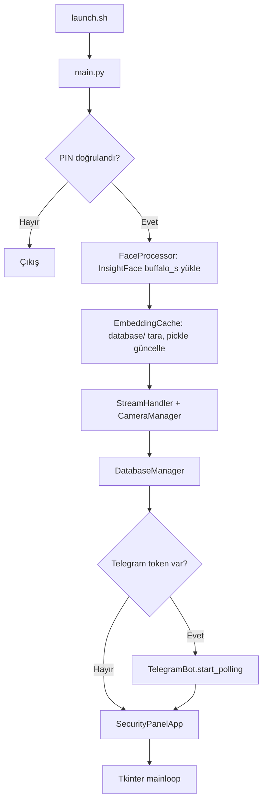
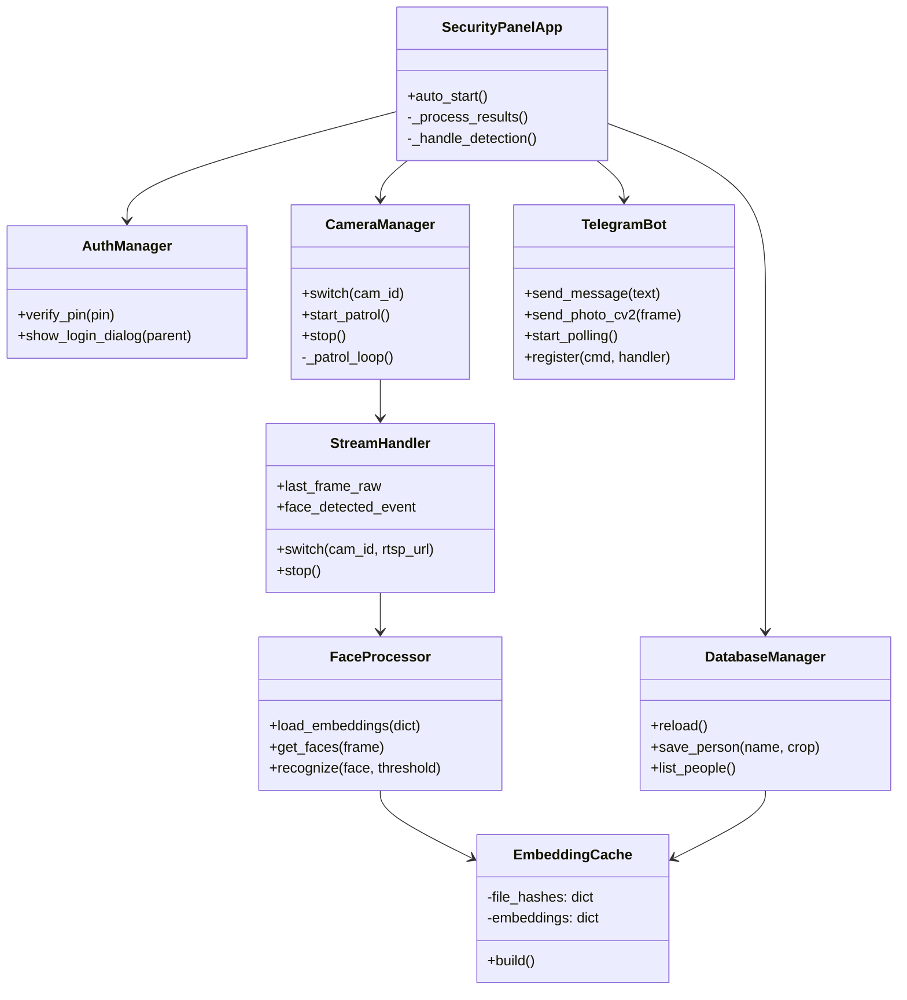
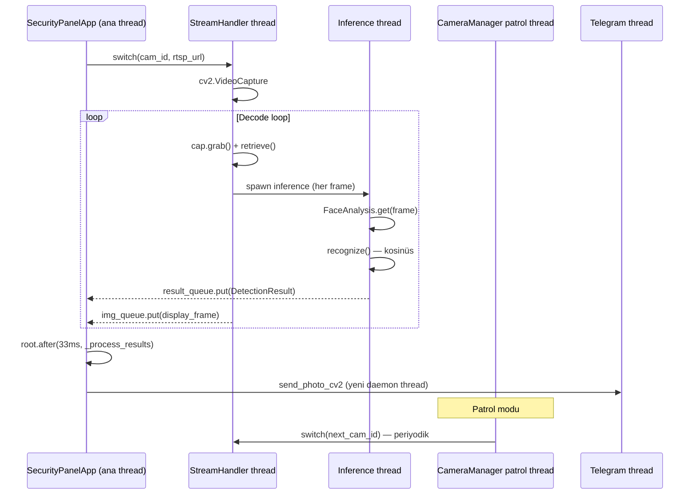
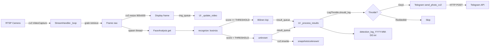
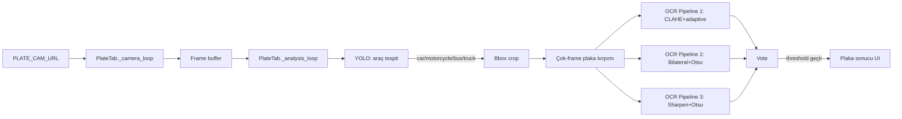
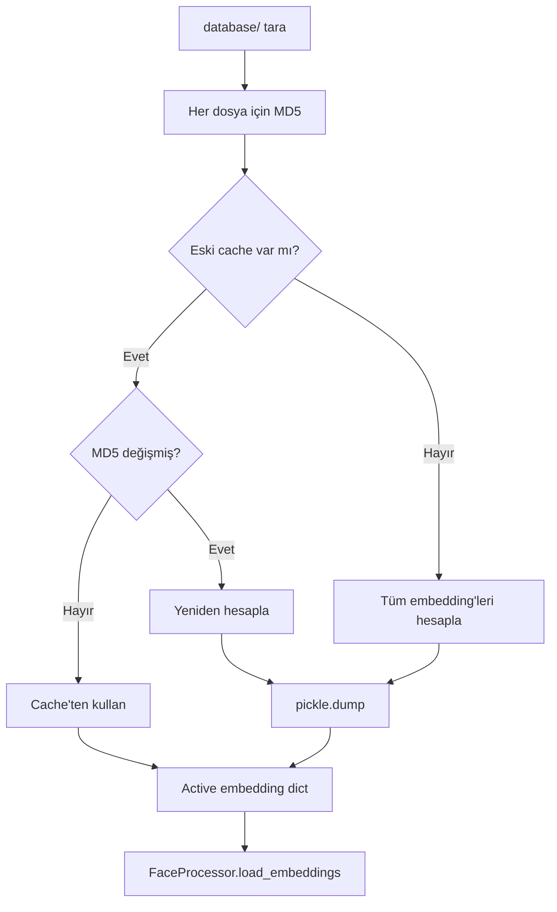

# Face Security V3 — Mimari Dokümantasyon

Bu doküman geliştiriciler için sistemin iç yapısını anlatır. Kullanıcı
dokümantasyonu için [`README.md`](../README.md) dosyasına bakın.

## İçindekiler

- [Genel Bakış](#genel-bakış)
- [Modül Haritası](#modül-haritası)
- [Başlatma Sırası](#başlatma-sırası)
- [Threading Modeli](#threading-modeli)
- [Veri Akışı](#veri-akışı)
- [Yapılandırma Yönetimi](#yapılandırma-yönetimi)
- [Bilinen Sınırlamalar](#bilinen-sınırlamalar)
- [Geliştirici Notları](#geliştirici-notları)

## Genel Bakış

Face Security V3, Tkinter tabanlı bir masaüstü uygulamadır. Tek bir Python
sürecinde çalışır, ana thread Tkinter event loop'unu çalıştırır, geri
kalan iş yükü daemon thread'lerde dağıtılır.



Mimari prensipler:

- **Tek-aktif-kamera:** Aynı anda yalnızca 1 RTSP akışı decode edilir. 25
  kamera tanımlı olsa da decode pipeline'ı tek bir kameraya ayrılır. Bu,
  CPU/RAM/ağ tasarrufu için bilinçli bir seçim.
- **Dosya tabanlı veritabanı:** SQL yoktur. Bilinen yüzler `database/`
  altında JPG'ler olarak tutulur, embedding'ler `embeddings_cache.pkl`
  içinde MD5-tabanlı invalidation ile cache'lenir.
- **Sync threading + Queue iletişimi:** asyncio kullanılmaz. Thread'ler
  `queue.Queue` üzerinden mesaj geçişi yapar (img_queue, result_queue).
- **Yerel-öncelikli:** Hiçbir veri (yüz embedding, snapshot, log)
  uzak sunucuya gönderilmez. Telegram istisna — kullanıcının kendi botuna
  bildirim gider.

## Modül Haritası

| Modül | Dosya | Sorumluluk |
|-------|-------|------------|
| `auth/` | `auth_manager.py` | PIN tabanlı kimlik doğrulama, Tk dialog |
| `camera/` | `camera_manager.py` | Kamera geçişi, otomatik devriye (patrol) |
| `camera/` | `stream_handler.py` | RTSP decode, frame queue'ya iletim, inference tetikleme |
| `database/` | `db_manager.py` | Yüz veritabanı (dosya sistemi tabanlı), reload, save |
| `detection/` | `face_processor.py` | InsightFace sarmalı, embedding + recognize |
| `detection/` | `embedding_cache.py` | Pickle tabanlı embedding cache, MD5 invalidation |
| `detection/` | `log_throttle.py` | Aynı kişi için tekrarlayan log/bildirim önleme |
| `detection/` | `plate_processor.py` | YOLO + 3-pipeline EasyOCR + oylama tabanlı plaka tanıma |
| `notifications/` | `telegram_bot.py` | Telegram Bot HTTP API (sync, daemon thread'lerde) |
| `ui/` | `security_panel_ui.py` | Ana pencere, kamera kontrol, log paneli |
| `ui/` | `plate_tab.py` | Plaka tanıma sekmesi (bağımsız pipeline) |
| `utils/` | `file_utils.py` | Path traversal koruması, güvenli dosya adı |
| `utils/` | `snapshot_cleaner.py` | Snapshot dizinlerinde yaş + sayı bazlı temizlik |
| `config.py` | — | Tüm `.env` parse + default değer + 25 kamera adı eşlemesi |
| `main.py` | — | Bağımlılık enjeksiyonu, başlatma sırası |
| `migrate_from_v2.py` | — | V2 → V3 yapılandırma göçü |

### Sınıf-Sorumluluk Özeti



## Başlatma Sırası

`main.py` aşağıdaki sırayla başlatma yapar (referans: main.py:56-147):

| # | İşlem | Konum |
|---|-------|-------|
| 0 | OpenCL etkinleştirme + log setup | main.py:58 |
| 1 | PIN doğrulama (Tk dialog, başarısızsa sys.exit) | main.py:61-68 |
| 2 | Tkinter root window oluştur | main.py:71 |
| 3 | InsightFace `buffalo_s` modelini yükle (det_size=640×640) | main.py:75 |
| 4 | EmbeddingCache.build() — `database/` klasörünü tara | main.py:78-84 |
| 5 | SnapshotCleaner.clean() — eski snapshot'ları temizle | main.py:87-93 |
| 6 | İki Queue oluştur: img_queue (maxsize=2), result_queue (maxsize=20) | main.py:96-97 |
| 7 | StreamHandler + CameraManager instance'ları | main.py:100-105 |
| 8 | DatabaseManager + self-reference (`db_manager.db_manager = db_manager`) | main.py:107-113 |
| 9 | TelegramBot (varsa) start_polling | main.py:116-131 |
| 10 | SecurityPanelApp UI başlat | main.py:134-142 |
| 11 | `root.after(1000, app.auto_start)` + `mainloop()` | main.py:144-147 |

## Threading Modeli

Sistem aşağıdaki thread'leri kullanır:

| Thread | Sınıf/Method | Yaşam Süresi | Daemon |
|--------|--------------|--------------|--------|
| Stream main loop | `StreamHandler._loop` | Aktif kamera değişene kadar | ✅ |
| Inference worker | `_run_inference_async` | Per-frame, kısa ömürlü | ✅ |
| Patrol | `CameraManager._patrol_loop` | start_patrol → stop | ✅ |
| Telegram poll | `TelegramBot._poll_loop` | Bot ömrü boyunca | ✅ |
| Telegram send | `send_photo`, `send_photo_cv2` | Per-gönderim, kısa ömürlü | ✅ |
| Plate camera | `PlateTab._camera_loop` | Tab aktif iken | ✅ |
| Plate analysis | `PlateTab._analysis_loop` | Tab aktif iken | ✅ |
| Tkinter (ana) | `root.mainloop()` | Süreç ömrü | — |

### Thread Senkronizasyonu



### Lock Envanteri

| Lock | Konum | Korunan | Notlar |
|------|-------|---------|--------|
| `_patrol_lock` | `CameraManager` | `_patrol_loop` tamamı | Tüm patrol döngüsü boyunca tutulur — kod kokusu, ancak başka thread bu lock'u almıyor (pratik etkisi yok) |
| `frame_lock` | `StreamHandler` | `last_frame_raw` r/w | Düzgün kullanılıyor |
| `_lock` | `StreamHandler` | — | Tanımlı ama hiç kullanılmıyor (ölü kod) |
| `_inf_running` (Event) | `StreamHandler` | Inference reentrancy | Aynı anda birden çok inference'i engeller |
| `face_detected_event` | `StreamHandler` | Patrol-stream iletişimi | Patrol bekleme döngüsü buna bakar |

## Veri Akışı

### Yüz Tanıma Pipeline'ı



### Plaka Tanıma Pipeline'ı (Bağımsız)



### Embedding Cache İnvalidasyonu



## Yapılandırma Yönetimi

İki katmanlı yapılandırma:

1. **`.env`** — Hassas değerler ve operatör tarafından sık değiştirilenler
   (kamera URL'leri, Telegram token, eşik değerleri)
2. **`config.py`** — `.env`'i okur, default'larla doldurur, hardcoded
   sabitleri tanımlar (kamera Türkçe isimleri, ekran boyutu)

### `.env` Değişkenleri (Kategorize)

| Kategori | Değişkenler | Sayı |
|----------|-------------|------|
| Kamera | `CAM_01_URL` ... `CAM_25_URL`, `PLATE_CAM_URL` | 26 |
| Telegram | `TELEGRAM_BOT_TOKEN`, `TELEGRAM_CHAT_ID` | 2 |
| Yollar | `DATABASE_PATH`, `KNOWN_PATH`, `UNKNOWN_PATH`, `LOG_DIR` | 4 |
| Plaka | `PLATE_VOTE_COUNT`, `PLATE_VOTE_THRESHOLD`, `PLATE_DUPLICATE_SECONDS`, `PLATE_INFERENCE_INTERVAL`, `PLATE_YOLO_MODEL`, `PLATE_YOLO_CONF` | 6 |
| Eşik/Parametreler | `THRESHOLD`, `INFERENCE_FPS`, `SNAPSHOT_COOLDOWN`, `PATROL_SCAN_SECONDS`, `PATROL_HOLD_SECONDS`, `LOG_THROTTLE_SECONDS`, `SNAPSHOT_MAX_AGE_DAYS`, `SNAPSHOT_MAX_FILES` | 8 |

### Diğer Yapılandırma Dosyaları

- **`auth_config.json`** — `pin_hash` (SHA256 → bcrypt'e geçişte),
  `auto_lock_minutes` (default 30)
- **`camera_config.json`** — `{"1": false, "2": true, ..., "25": false}`
  formatında startup-aktif flag'leri (UI startup_vars ile eşleşir)
- **`startup_config.json`** — Minor UI durumu (default kamera, vs.)

## Bilinen Sınırlamalar

Mevcut sürümde tasarımdan veya implementasyondan kaynaklanan sınırlamalar:

### Kamera Stream

- **Otomatik reconnect yok:** RTSP URL düşerse manuel kamera değişimi
  gerekir. `launch_error.log`'daki "Stream timeout 30000ms" hatalarının
  kaynağı budur.
- **Configurable timeout yok:** OpenCV varsayılanı (~30 sn) kullanılır.
- **try/finally eksik:** `StreamHandler._loop` içinde beklenmedik exception
  olursa `cap.release()` çağrılmayabilir → handle leak riski.
- **Tek-aktif-kamera:** Paralel multi-cam decode mevcut değildir. Patrol
  modu kameraları sırayla geçer.

### Tanıma

- **Pickle güvenliği:** `embeddings_cache.pkl` pickle formatındadır.
  Lokal kullanım için sorun değil, ancak **güvenilmeyen kaynaktan
  yüklenmemelidir.**
- **Ölçeklenme:** Bilinen kişi sayısı arttıkça (>1000) brute-force kosinüs
  karşılaştırması yavaşlar. FAISS gibi ANN index'i bu sürümde yoktur.

### Telegram

- **Rate limiting yok:** Yoğun trafikte Telegram API rate limit'ine
  takılınabilir (saniyede 30 mesaj sınırı).
- **Send-thread leak:** Her `send_photo` çağrısı yeni daemon thread oluşturur.
  Yoğun trafikte thread sayısı artabilir (daemon olduğu için süreç sonunda
  temizlenir, ama bellek tüketimi olur).
- **Sync HTTP:** `requests` blocking — ayrı thread'de izolasyon sağlasa da
  hata yönetimi spesifik değil (geniş `except Exception`).

### Test Coverage

- 27 modülden sadece 3'ü için test var (auth, file_utils, log_throttle).
- Camera, detection, database, notifications için entegrasyon testi yok.

### Diğer

- **Log rotation yok:** `logs/` sınırsız büyüyebilir. Snapshot temizliği
  var ama log dosyaları için yok.
- **launch.sh mutlak path:** `cd /home/user/Masaüstü/face_security_v3`
  hardcoded — sistem taşınırsa kırılır.
- **`tkinter import *`:** Birkaç UI dosyasında namespace kirliliği var.
- **`db_manager.db_manager = db_manager` self-reference:** main.py'de
  geçici çözüm yorumu var, kalıcı refactor bekliyor.

## Geliştirici Notları

### Yeni bir kamera ekleme

1. `.env`'e `CAM_NN_URL=rtsp://...` satırı ekle (NN: 26+)
2. `config.py`'deki `CAMERA_NAMES` dict'ine Türkçe ad ekle
3. UI'daki kamera grid'i otomatik güncellenmez — `security_panel_ui.py`
   kamera button grid'i hardcoded 5×5 (TODO: dinamikleştir)

### Yeni bir Telegram komutu eklemek

`telegram_bot.py`'de `register(command, handler)` API'si var:

```python
def my_handler(args, chat_id):
    bot.send_message("Cevabım", chat_id)

bot.register("mycmd", my_handler)
```

### Eşik ayarlamak

Yanlış-pozitif fazlaysa `.env`'de `THRESHOLD` değerini yükseltin (0.45 →
0.55). Yanlış-negatif (tanınanları unknown sayma) fazlaysa düşürün.

### Test çalıştırmak

```bash
pip install pytest    # requirements-dev.txt'e eklenecek
pytest tests/ -v
```

### Performans Profili

Kabaca:
- InsightFace `buffalo_s` ~30-50 ms/inference (CPU, 640×640)
- YOLO `yolov8n` ~20-40 ms/frame (CPU)
- EasyOCR ~100-200 ms/plaka kırpımı

GPU ile bu süreler 5-10× düşer (`onnxruntime-gpu` aktif edilmeli).

## Mevcut Olmayan Özellikler

Bu sistem aşağıdakilere sahip **değildir** (yanılgıya düşmemek için):

- ❌ Web arayüzü (sadece desktop Tkinter)
- ❌ Çoklu kullanıcı / rol yönetimi (tek PIN)
- ❌ Cloud sync / backup
- ❌ Mobile app (Telegram bot dışında)
- ❌ Video kayıt / DVR (sadece anlık snapshot)
- ❌ SQL veritabanı (dosya tabanlı)
- ❌ Multi-cam paralel decode
- ❌ Otomatik RTSP reconnect
- ❌ Production-grade ölçeklendirme (>50 kamera)
